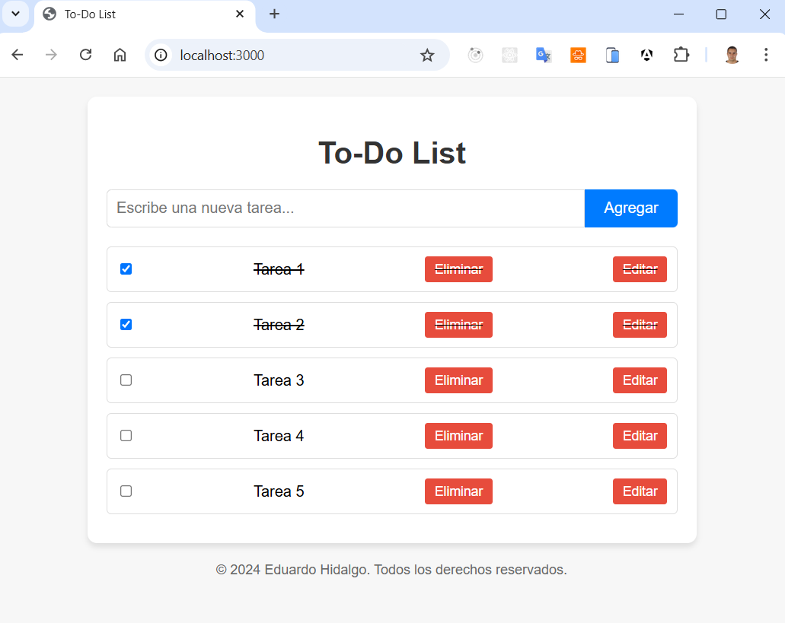

# ToDo List App

Una aplicación web sencilla y funcional para gestionar tareas diarias.

## 📋 Descripción

La **ToDo List App** es una aplicación que permite a los usuarios organizar sus tareas diarias mediante un sistema CRUD (Crear, Leer, Actualizar y Eliminar). La integración entre el frontend y el backend asegura una experiencia fluida y práctica.

## 🚀 Características

- **Agregar Tareas**: Permite añadir nuevas tareas a la lista.
- **Editar Tareas**: Modifica las tareas existentes.
- **Eliminar Tareas**: Elimina tareas que ya no son necesarias.
- **Marcar como completadas**:  Indica visualmente las tareas finalizadas.
- **API Backend**: Implementación de rutas para gestionar tareas mediante Node.js y MongoDB.

## 🛠️ Tecnologías Utilizadas

- **Frontend**:
  - HTML5, CSS3, y JavaScript.
- **Backend**:
  - Node.js, Express.js.
  - MongoDB para la persistencia de datos.

## 📂 Estructura del Proyecto

```plaintext
project/
│
├── index.html        # Estructura del frontend
├── style.css         # Estilos para la interfaz
├── script.js         # Lógica para manejar las tareas
│
├── models/
│   └── Task.js       # Modelo de datos para MongoDB
│
├── routes/
│   └── tasks.js      # Rutas CRUD para la API
│
├── app.js            # Configuración principal del servidor
└── README.md         # Documentación del proyecto
```

## 📚 API - Rutas y Funcionalidad

### **Modelo: `Task`**
```javascript
{
  description: String,    // Descripción de la tarea
  completed: Boolean,     // Estado de la tarea (por defecto: false)
  timestamps: true        // Campos automáticos createdAt y updatedAt
}
```

### **Rutas CRUD**

1. **GET `/api/tasks`**
   - Recupera todas las tareas.
   - **Respuesta**:
     ```json
     [
       { "_id": "1", "description": "Tarea 1", "completed": false },
       { "_id": "2", "description": "Tarea 2", "completed": true }
     ]
     ```

2. **POST `/api/tasks`**
   - Crea una nueva tarea.
   - **Cuerpo**:
     ```json
     { "description": "Nueva tarea" }
     ```

3. **PUT `/api/tasks/:id`**
   - Actualiza una tarea existente por su ID.
   - **Cuerpo**:
     ```json
     { "description": "Descripción actualizada", "completed": true }
     ```

4. **DELETE `/api/tasks/:id`**
   - Elimina una tarea por su ID.
   - **Respuesta**:
     ```json
     { "message": "Tarea eliminada" }
     ```

## 📦 Instalación y Uso

### Requisitos Previos

1. Tener instalado **Node.js** y **npm**.
2. Tener acceso a una instancia de **MongoDB** (local o en la nube).

### Configuración

1. Clona este repositorio:
   ```bash
   git clone https://github.com/hidalgo86/To-Do-list
   cd todolist
   ```

2. Instala las dependencias:
   ```bash
   npm install
   ```

3. Configura las variables de entorno:
   - Crea un archivo `.env` en el directorio raíz con el siguiente contenido:
     ```plaintext
     MONGO_URI=tu_url_de_mongodb
     PORT=3000
     ```

### Ejecución

1. Inicia el servidor:
   ```bash
   npm start
   ```

2. Abre la aplicación en tu navegador:
   [http://localhost:3000](http://localhost:3000)

## 🌟 Uso

1. Escribe una tarea en el campo de texto y presiona **Agregar**.
2. Edita las tareas utilizando el botón **Editar**.
3. Elimina las tareas no deseadas con el botón **Eliminar**.
4. Marca una tarea como completada haciendo clic sobre ella.

## 🎨 Capturas de Pantalla

### Página Principal

  
*Interfaz limpia y minimalista para gestionar tareas.*

## 🤝 Contribuciones

¡Las contribuciones son bienvenidas! Si deseas mejorar este proyecto:

1. Haz un fork del repositorio.
2. Crea una nueva rama (`git checkout -b feature/nueva-funcionalidad`).
3. Realiza tus cambios y haz un commit (`git commit -m "Agrego nueva funcionalidad"`).
4. Haz un push a la rama (`git push origin feature/nueva-funcionalidad`).
5. Abre un pull request.

## 📝 Licencia

Este proyecto está bajo la licencia **MIT**. Consulta el archivo `LICENSE` para más detalles.

## 📧 Contacto

Desarrollado por **Eduardo Hidalgo**.  
Para más información, contáctame en: [hidalgojose86@gmail.com](mailto:hidalgojose86@gmail.com).
